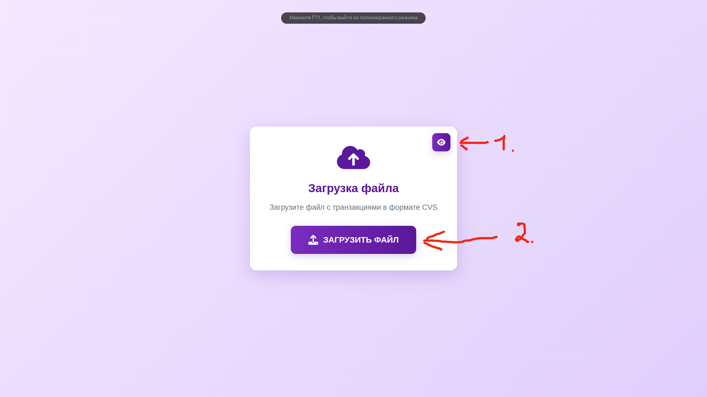
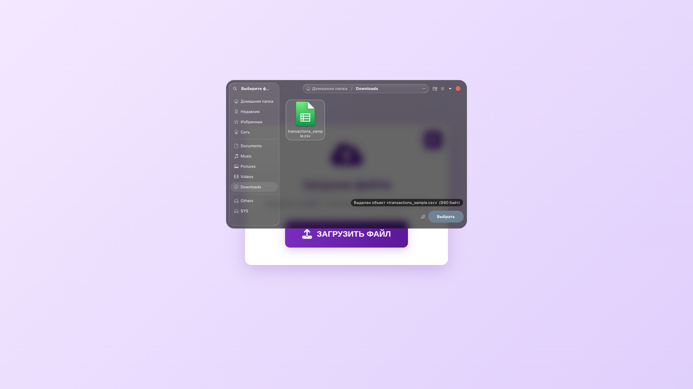
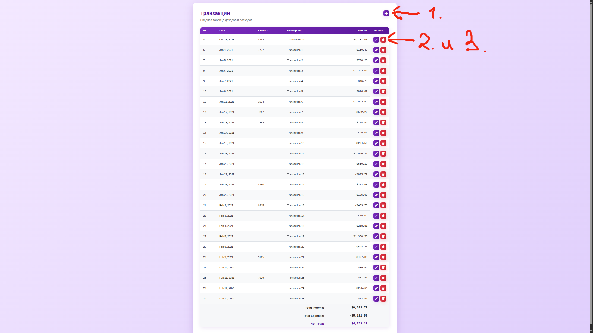
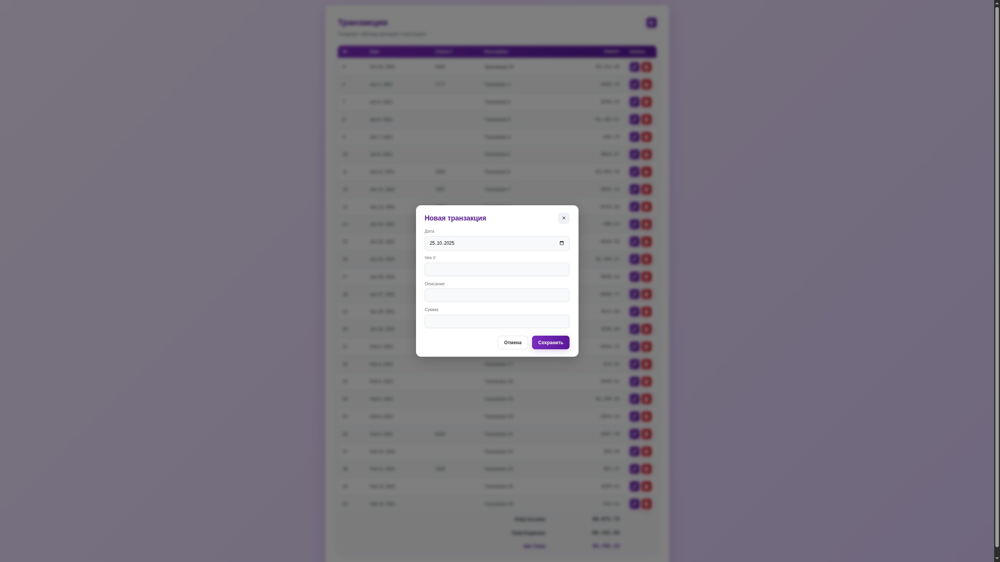

### Главная страница

> На главной странице расположены две кнопки:
> 1.  **Просмотр транзакций** - переход на страницу со списком всех транзакций.
> 2.  **Загрузить файл** - переход на страницу загрузки файла с транзакциями в формате CSV.

### Страница загрузки файла с транзакциями

> На этой странице можно выбрать и загрузить CSV-файл с транзакциями.

### Страница с транзакциями

> На странице с транзакциями доступны следующие действия:
> 1.  **Добавить транзакцию** - открывает модальное окно для добавления новой транзакции.
> 2.  **Редактировать транзакцию** - открывает модальное окно для редактирования выбранной транзакции.
> 3.  **Удалить транзакцию** - удаляет выбранную транзакцию.

### Модальное окно добавления транзакции

> Модальное окно для добавления новой транзакции. Позволяет ввести дату, описание, сумму и выбрать тип транзакции (доход или расход).

### Модальное окно редактирования транзакции

> Модальное окно для редактирования существующей транзакции. Позволяет изменить дату, описание, сумму и тип транзакции.